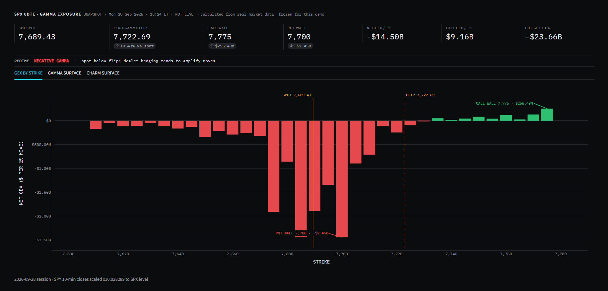

# SPX 0DTE Gamma Exposure Dashboard

A Python dashboard that estimates where options dealers' hedging is likely to **dampen or amplify** S&P 500 moves, using options that expire the same day (0DTE).

**[Open the demo](https://spx-gex-demo.streamlit.app/)** · Built by Alonzo Goffe

> **Educational and portfolio project. Not investment advice.** The demo shows the tool's output from a real session (Mon 28 Sep 2026, 15:24 ET), saved as a snapshot, not a live feed. No trades are placed by this tool.



---

## What it shows

| Output | Plain-English meaning |
|---|---|
| **Gamma exposure (GEX)** | Dollars of the index dealers would need to buy or sell for every 1% move in the S&P 500. Positive (green) = their hedging leans against the move. Negative (red) = it adds to the move. |
| **Zero-gamma flip** | The price where total GEX crosses from positive to negative. Above it markets tend to be calmer; below it, moves tend to be larger and faster. |
| **Call / put walls** | The strikes carrying the largest call and put exposure. Hedging activity clusters around them during the day. |
| **Gamma and charm surfaces** | Heatmaps projecting exposure across price (±1% of spot) and time (open to the 4:00 PM expiry), with the day's price path overlaid. |

## How it works

1. **Pull the chain.** Today's SPX option chain, spot price and intraday bars from the Schwab Market Data API (OAuth 2.0 with automatic token refresh).
2. **Size the exposure.** For each contract: `gamma × open interest × 100 × spot² × 1%`. Calls count positive, puts negative (dealers assumed short calls, long puts).
3. **Find the flip.** Re-price every contract with Black-Scholes across ±3% of spot and interpolate where total GEX crosses zero.
4. **Project the session.** Build a 60 × 40 price-by-time grid of gamma and charm through the close.
5. **Render.** Streamlit and Plotly draw the key levels, strike ladder and surfaces, refreshing every 2 minutes (every 30 seconds in the final 15 minutes).

## Engineering notes

- **Found and fixed a wrong flip level.** The first version returned the first strike where GEX changed sign, which could land on an empty strike hundreds of points from the market. It now uses a zero-gamma price sweep that is consistent with the heatmap.
- **Readable units.** Raw GEX had no units; it is now reported in dollars per 1% move, the convention used in market research.
- **Live intraday prices.** Schwab's SPX price history only updates at end of day, so the price path uses live SPY bars scaled to the SPX level.
- **Stable near expiry.** A 5-minute floor on time-to-expiry keeps gamma from blowing up in the last minutes of the session.
- **Credentials and data kept out of the repo.** API keys live in environment variables, the token file sits outside the repository, and demo mode never loads the login module.
- **Snapshots store results, not data.** The demo snapshot holds only the tool's own calculated outputs (net GEX by strike, totals, flip level, gamma/charm surfaces) plus the SPX index level. The raw option chain is used in memory and never saved.

## Project structure

| File | Purpose |
|---|---|
| `app.py` | Streamlit dashboard. Chooses demo or live mode. |
| `gex.py` | GEX math: exposure by contract and strike, zero-gamma flip. No UI, no network. |
| `greeks.py` | Black-Scholes gamma and charm, vectorized with NumPy. |
| `heatmaps.py` | Price-by-time gamma and charm surfaces. |
| `demo_data.py` | Loads a saved snapshot into the same results structure the live app builds. |
| `schwab_live.py` | Schwab API access: OAuth tokens, quotes, chains, price history. Live mode only. |
| `snapshot.py` | Runs the calculations on the current chain and saves only the results for demo mode. |
| `snapshots/` | Saved snapshots (calculated outputs only) used by the demo. |
| `Launch_Demo.bat` | Windows shortcut: runs the dashboard in demo mode. |

## Run it

**Demo mode (no account needed)**

```bash
pip install -r requirements.txt
streamlit run app.py
```

With no credentials configured, the app loads the newest file in `snapshots/`. On Windows you can also double-click `Launch_Demo.bat`.

**Live mode (requires a Schwab developer account)**

1. Copy `.env.example` to `.env` and fill in your own app key, secret, callback URL and a token-file path **outside** this folder.
2. `streamlit run app.py` and log in with Schwab when prompted.
3. Optional: `python snapshot.py` during market hours saves a new demo snapshot.

## Known limitations

- Dealer positioning is assumed (short calls, long puts), not observed.
- Open interest is published once a day, so contracts opened today are not counted.
- Greeks come from Black-Scholes using each contract's implied volatility; real dealer books differ.
- The public demo is a frozen snapshot.

## Tech stack

Python · pandas · NumPy · Plotly · Streamlit · Schwab Trader API (Market Data)

---

Not affiliated with or endorsed by Charles Schwab. The demo shows this tool's calculated outputs and the SPX index level, not raw option-chain data.
